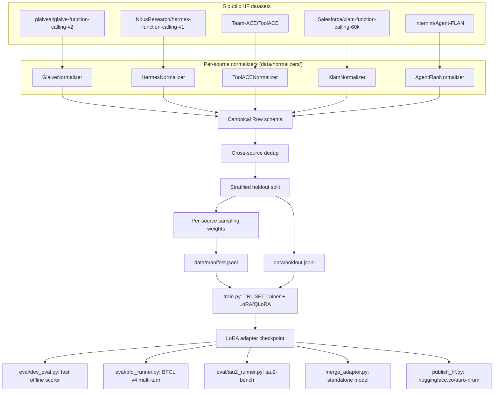

# AgentForge — Technical Documentation

This document covers the full architecture, the math behind the fine-tuning
method, every dataset normalizer's parsing logic (including the real bugs
found and fixed while building them), the evaluation methodology, and the
infrastructure this project runs on. It assumes the reader has read the
[README](README.md) for the project's scope and positioning; this document
goes one level deeper into *how* and *why*.

## 1. Positioning, restated precisely

AgentForge instruction-tunes `google/gemma-4-12B-it` via LoRA/QLoRA to
address one specific, narrow problem: **the base model's documented
multi-turn tool-context degradation** ([HF discussion
#28](https://huggingface.co/google/gemma-4-12B-it/discussions/28)), where
the model loses track of its own prior tool outputs across a multi-turn
conversation. This scope was arrived at deliberately, not by default —
two independent research passes found that a generic "add tool-calling"
framing would have been redundant (the base model already has native
tool-call tokens; 50+ community fine-tunes already exist for this base
model within weeks of its release) and that BFCL's overall composite score
(70% weighted toward agentic/multi-turn/RL-trained capability) is a poor
target for plain SFT on static data. The project is scoped to what plain
SFT can plausibly move: multi-turn tool-context retention, trained
primarily via `internlm/Agent-FLAN`'s ReAct trajectories.

This shapes several downstream decisions documented below: the data mix
weighting (§5), which eval categories are the headline metric vs. a
regression check (§9), and why `assistant_only_loss` and `max_length` are
tuned for multi-turn conversations rather than single-call brevity.

## 2. System architecture



Everything from "5 public HF datasets" through "Publish" runs on a rented
AWS GPU instance (`scripts/aws/bootstrap_and_train.sh`), never on the local
development machine — see §11.

## 3. Canonical data schema

`src/agentforge/data/schema.py` defines the single shape every normalizer
must emit into, chosen specifically because it's the shape TRL's
`SFTTrainer` expects natively for tool-calling conversational datasets (a
`messages` column with `tool_calls`/`tool`-role turns, plus a `tools`
column of JSON-schema function definitions) — so `manifest.jsonl` loads
directly via `datasets.load_dataset("json", ...)` with zero adapter code
between the manifest and the trainer.

```python
class FunctionCall(BaseModel):
    name: str
    arguments: str   # JSON-encoded STRING, not a dict — OpenAI convention

class ToolCall(BaseModel):
    id: str
    type: Literal["function"] = "function"
    function: FunctionCall

class Message(BaseModel):
    role: Literal["system", "user", "assistant", "tool"]
    content: str | None = None
    tool_calls: list[ToolCall] | None = None   # only role="assistant"
    tool_call_id: str | None = None            # only role="tool"
    name: str | None = None                    # only role="tool"

class ToolSpec(BaseModel):
    type: Literal["function"] = "function"
    function: dict   # {name, description, parameters: JSONSchema}

class Row(BaseModel):
    id: str
    source: Literal["glaive", "hermes", "toolace", "xlam", "agent_flan"]
    messages: list[Message]
    tools: list[ToolSpec] = []
    meta: dict = {}
```

**Validation is layered, and deliberately not uniformly strict:**

- **Hard failures** (raise, row gets dropped by the calling `Normalizer`):
  `FunctionCall.arguments` must be valid JSON text; `tool_calls` can only
  appear on `role="assistant"`; a `role="tool"` message must set
  `tool_call_id`; a `Row` must have ≥1 message and must start with
  `system` or `user`.
- **Soft check** (`meta["orphan_tool_response"] = True`, row is *kept*):
  a `role="tool"` message's `tool_call_id` doesn't match any `id` seen in
  an earlier `tool_calls` list. This is deliberately lenient because
  several source datasets (see §4) have imperfect call/response linkage in
  their raw form, and dropping every row with a linkage quirk would throw
  away otherwise-useful training signal. `manifest_stats.json` reports the
  rate so it can be monitored rather than silently ignored.

The `Normalizer` ABC (`data/normalizers/base.py`) enforces this
uniformly: `to_canonical()` may return `None` (drop, with a reason string)
or raise (caught, drop, reason = exception type name), and every
successfully-constructed `Row` is re-validated via
`Row.model_validate(row.model_dump())` before being counted as emitted —
no malformed row reaches the manifest silently.

## 4. Dataset normalizers — parsing logic and real bugs found

Each normalizer maps one dataset's native format to the canonical schema.
All five were built in parallel by independent agents against a shared
contract, then integrated and tested together; this section documents what
each one actually does, plus every real defect found and fixed during that
process (not hypothetical edge cases — actual bugs caught by tests).

### 4.1 `glaive.py` — the reference implementation

Native format: a `system` string (prose + embedded JSON tool definitions)
and a `chat` string with `USER:`/`ASSISTANT:`/`FUNCTION RESPONSE:` markers
and inline `<functioncall> {json}` payloads.

**Real bug found and fixed**: the first implementation extracted the
`<functioncall>` JSON payload with a non-greedy regex, `\{.*?\}`. This
breaks on nested braces — and glaive's real data has exactly that: tool
parameter schemas nest objects (`{"parameters": {"type": "object", ...}}`),
and even the `arguments` field itself is a known glaive quirk: it's
sometimes wrapped in single quotes around an already-JSON string, e.g.
`{"name": "get_weather", "arguments": '{"city": "Paris"}'}`. The fix,
`find_balanced_brace_span()` (promoted to the shared `react_parsing.py`
module — see §4.6), does a proper stack-based brace-matching scan that
tracks `"`-delimited string state, so it correctly finds the *complete*
outer span regardless of nesting. A second repair step,
`_parse_functioncall_payload()`, retries with a regex substitution that
strips the single-quote wrapping if direct `json.loads` fails, converting
the malformed-as-JSON `'{...}'` into a nested object.

Turn-response linkage uses an `open_calls: dict[call_id, function_name]`
pattern — the most recent entry (`next(reversed(open_calls.items()))`) is
assumed to be what a following `FUNCTION RESPONSE:` answers. This same
pattern is reused, nearly verbatim, by every other normalizer that needs
call/response linkage (hermes, toolace, agent_flan).

### 4.2 `hermes.py`

Native format: ShareGPT-style `conversations: [{from, value}]`, split
across multiple dataset configs on the HF hub (exact config list
unverified against the live dataset — the normalizer's `_PLAUSIBLE_CONFIGS`
list is explicitly flagged as a placeholder pending confirmation).
`<tools>...</tools>`, `<tool_call>...</tool_call>`, and
`<tool_response>...</tool_response>` XML tags carry the structured payload
within otherwise free-text turns.

A tool response can appear either as its own `from: "tool"` entry or
embedded inside a `from: "human"` turn (detected by tag presence, not
trusted from the `from` field alone) — both paths are handled. Every row is
tagged `meta["hermes_config"]` with its source config name so
`build_manifest.py` could apply differential weighting later (e.g. zero-
weighting pure structured-extraction configs that aren't really
tool-calling data) — not currently exercised in the default config, but the
plumbing is there.

**Parsing subtlety documented in-code**: real Hermes system prompts
describe the `<tools>` tag *before* the actual populated tag appears later
in the same prompt (instructional prose like "...within `<tools></tools>`
XML tags..." followed by the real tag). The extractor prefers the *last*
non-empty `<tools>...</tools>` match rather than the first, to avoid
extracting the descriptive mention instead of the real payload.

### 4.3 `toolace.py`

Native format: `system` (tool defs, same brace-matching extraction as
glaive) + ShareGPT `conversations: [{from: human|gpt, value}]` — critically,
**no native tool/observation role at all**. A `gpt` turn's `value` is
either a JSON list of `{name, arguments}` dicts (a structured tool call) or
plain prose.

**Design decision, explicitly flagged as unverified**: since there's no
native "this is an observation" marker, the normalizer applies a heuristic
— if a `human` turn immediately follows an `assistant` turn that emitted
`tool_calls`, that `human` turn is remapped to `role="tool"` (it's likely a
simulated environment response, not a genuine new user question). This is
implemented as a standalone check
(`_should_remap_to_tool_role`, looking only at whether the immediately
preceding message is a tool-calling assistant turn) rather than folded into
the shared `react_parsing.py` module, specifically to avoid two
concurrently-developed normalizers editing the same shared file. **This
heuristic has not been checked against real ToolACE rows** — the code
contains an explicit comment that ~10 real rows should be pulled and
inspected before trusting it at scale, since a genuine multi-turn user
follow-up question immediately after a tool call would be misclassified
the same way.

### 4.4 `xlam.py` — the simple one

Native format: flat, single-turn columns — `query` (str), `tools` (JSON
string), `answers` (JSON string of `[{name, arguments}]`). No multi-turn
parsing needed; this is the most mechanical normalizer.

**Gated dataset handling**: `Salesforce/xlam-function-calling-60k` requires
accepting HF's terms + a valid `HF_TOKEN`. The normalizer's network path
detects a gated-access failure (checked against real
`huggingface_hub.errors.GatedRepoError`, plus a string-marker fallback for
other auth-failure shapes) and re-raises a clear, actionable `RuntimeError`
pointing at the dataset page, rather than letting a raw 401 traceback
surface with no context.

**Design choice**: a row with an empty `answers` list is dropped rather
than emitted as an assistant turn with `tool_calls=[]` — xLAM has no
natural-language assistant field to fall back to, so an empty-calls turn
would be `content=None` *and* `tool_calls=[]`, i.e. nothing learnable.

### 4.5 `agent_flan.py` — the headline dataset, and the most complex parser

Native format (verified against the real dataset, not guessed): columns
`id` and `conversation: [{role, content, loss}]`, roles limited to
`system`/`user`/`assistant` — **no structured tool_calls anywhere in the
raw data; it's entirely free-text Thought/Action/Action Input/Observation
prose.** Seven splits exist on the hub; only the two ReAct-bearing ones
(`agent_instruct_react`, `toolbench_react_10p`) are loaded by default — the
rest (`*_tflan*` variants) are already-reformulated instruction data
without the raw ReAct structure, available via constructor override for
later ablation but excluded by default.

**The core design decision**: OpenAI-style messages already let an
assistant turn carry `content` (the Thought) *and* `tool_calls` (the
Action) simultaneously, and a `tool`-role message is the natural home for
an Observation. So free-text ReAct gets **parsed into structured
`tool_calls`** wherever a clean match is found, with a lenient fallback
rather than a drop when parsing is imperfect — never silently discarding
data because a regex didn't match cleanly.

The parsing pipeline, per assistant turn:
1. `parse_react_turn(content)` (shared helper, `react_parsing.py`) regex-matches
   `Thought: ...\nAction: <name>\nAction Input: <anything up to the next marker>`.
2. If matched: `react_action_input_to_arguments_json()` validates the
   Action Input text as JSON. Valid → used as-is. Invalid → wrapped as
   `{"input": <raw text>}` and the row is tagged `meta["args_raw"] = True`
   — a lenient repair, not a drop.
3. If `parse_react_turn` finds no match at all (no `Action:` line — e.g. a
   final free-text answer turn): the turn is kept as plain `content`, and
   the row is tagged `meta["parsed_from_text"] = True`.

For `user` turns: `is_observation_turn()`/`strip_observation_prefix()`
detect a literal `"Observation:"` prefix and remap that turn to
`role="tool"`, linked back to the most recently opened call via the same
`open_calls` pattern as glaive.

**Real bug found and fixed** (in the *shared* `react_parsing.py`, not this
file — caught while building this normalizer): the original
`REACT_TURN_RE` hard-required Action Input to be brace-wrapped
(`Action Input:\s*(?P<action_input>\{.*\})`). A genuinely brace-less
malformed input (`Action Input: city=Paris`, real ToolBench-derived noise)
**never matched the regex at all** — it fell straight into the
`parsed_from_text` branch, never reaching step 2's lenient JSON-repair
fallback, which was only reachable for inputs that *were* brace-wrapped but
invalid (e.g. `{city: Paris}`). Fixed by capturing everything up to the
next `Thought:`/`Action:`/`Observation:` marker (or end of string) instead
of requiring a `{` prefix, so both failure modes now reach the same
lenient-repair path.

**Semantic caveat, documented deliberately rather than accidentally
discovered later**: `meta["parsed_from_text"]` is set per-turn-failure, not
aggregated per-row. Since every well-formed ReAct trajectory ends in a
terminal free-text answer (no `Action:` line left to emit), that final turn
always fails the parse and sets this flag — even on an otherwise fully
structured multi-cycle trajectory. The flag means "at least one assistant
turn in this row wasn't structured," not "this row has no tool calls." A
test (`test_parsed_from_text_flag_on_a_row_level_covers_the_terminal_turn`)
locks this in explicitly so it isn't mistaken for a bug later.

### 4.6 Shared helpers (`react_parsing.py`)

- `find_balanced_brace_span(text, start)` — anchored balanced-brace scan
  from one exact starting index. Promoted from a private glaive.py helper
  once `eval/tool_call_parsers.py` needed the same "the object starting
  exactly here" semantics (see §9.1's bug).
- `extract_json_objects(text)` — scans an entire string for *all*
  top-level `{...}` objects anywhere in it (used where "any tool-def JSON
  blocks somewhere in this prose" is the right semantic, e.g. stripping
  tool defs out of a `system` prompt — not appropriate where position
  matters, see §9.1).
- `parse_react_turn`, `react_action_input_to_arguments_json`,
  `is_observation_turn`, `strip_observation_prefix` — the ReAct-specific
  helpers described in §4.5.

## 5. Manifest pipeline: dedup, holdout, weighting

`data/build_manifest.py` orchestrates the full pipeline in a strict order,
split into a network-touching step (`run_normalizers`) and a pure,
fully-unit-tested step (`process_rows`) — deliberately separated so the
dedup/holdout/weighting logic is testable against synthetic data with zero
network access.

**Order matters**: dedup → holdout split → weighting, in that exact
sequence. Carving the holdout set *before* applying sampling weights is
load-bearing: weighting can oversample **with replacement** (see below),
and if that happened before the holdout split, the same underlying example
could end up duplicated into both the train manifest and the holdout set —
a data leak. Splitting first, then weighting only the remaining train pool,
makes that structurally impossible.

**Dedup** (`_dedupe_across_sources`): exact-duplicate detection via
`sha256(json.dumps([m.model_dump() for m in row.messages], sort_keys=True))`
— content-based, not id-based, so the same underlying conversation
appearing (accidentally or not) under two different source datasets still
gets deduplicated to one copy, keeping the first occurrence encountered.

**Stratified holdout split** (`eval/holdout_manifest.py`): for each source,
`n_holdout = min(len(rows), max(1, round(holdout_size * source_share)))`,
where `source_share = len(source_rows) / total_rows` — proportional to each
source's share of the deduped pool, with every non-empty source guaranteed
at least one holdout row regardless of how small its share rounds down to.
Default `holdout_size = 750`.

**Per-source sampling weight** (`data/mix.py`, `apply_source_weight`): a
weight is a *relative-oversampling target*, not a probability — weight
`1.0` keeps a source's post-holdout pool exactly as-is; weight `3.0` means
"make this source's contribution to the manifest ≈3× its own row count."
Concretely:

```
target_count = round(weight * len(rows))
if target_count <= len(rows):
    sample WITHOUT replacement, size = target_count   # undersampling
else:
    full_copies, remainder = divmod(target_count, len(rows))
    result = rows * full_copies + sample(rows, remainder)   # oversampling
```

The oversampling branch guarantees every row appears at least
`full_copies` times before any row is duplicated a `full_copies + 1`-th
time (rather than naive `random.choices` with replacement, which would let
some rows appear 0 times and others many, purely by chance, at a given
target count) — closer to the intended multiplier being actually achieved
across the whole source rather than in expectation only.

**Configured weights** (`configs/gemma4-12b-qlora.yaml`):

| Source | Weight | Rationale |
|---|---|---|
| `agent_flan` | 3.0 | Headline dataset (§1) — deliberately the dominant training signal, oversampled well past its natural size |
| `glaive` | 1.0 | Supporting: single-call schema correctness |
| `hermes` | 1.0 | Supporting |
| `toolace` | 1.0 | Supporting |
| `xlam` | 0.5 | Supporting, downweighted (60k rows would otherwise dominate the mix by raw volume) |

`manifest_stats.json` (written by `process_rows`) records, per source: raw
row count, emitted/dropped counts + drop reasons, post-dedup count,
holdout count, post-weight manifest count, and configured weight — plus
manifest-wide and holdout-wide aggregate metrics (avg turns per row, % rows
with `tool_calls`, % `parsed_from_text`, % `args_raw`, % `orphan_tool_response`).
This is the artifact to inspect before ever starting a real training run.

## 6. Fine-tuning method: the math

### 6.1 LoRA

For a pretrained weight matrix `W₀ ∈ ℝ^(d×k)`, LoRA freezes `W₀` entirely
and represents the update as a low-rank decomposition:

```
W = W₀ + ΔW = W₀ + (α/r) · B·A
```

where `B ∈ ℝ^(d×r)`, `A ∈ ℝ^(r×k)`, and `r ≪ min(d, k)`. Only `A` and `B`
are trained; `A` is initialized with a random Gaussian, `B` with zeros, so
`ΔW = 0` at the start of training (the adapted model is initially
identical to the base model). The forward pass becomes
`h = W₀x + (α/r)·BAx`.

This project's config (`lora.r=16, lora_alpha=32`):
- Rank `r = 16` — the bottleneck dimension of the update.
- `α = 32`, giving a scaling factor `α/r = 2`.
- `target_modules = [q_proj, k_proj, v_proj, o_proj, gate_proj, up_proj, down_proj]`
  — every linear projection in each transformer block's attention and MLP
  sublayers gets its own independent low-rank adapter, not just attention
  (a common narrower choice). Broader coverage costs more trainable
  parameters but gives the adapter more surface area to represent the
  target behavior change.
- `bias = "none"` — bias terms stay frozen, only the `A`/`B` matrices train.

Trainable parameter count per adapted linear layer: `r × (d + k)`, versus
`d × k` for full fine-tuning of that layer — for `d = k = 4096`
(a plausible hidden dim) and `r = 16`, that's `16 × 8192 = 131,072`
trainable parameters versus `16,777,216` for the full matrix, a ~128×
reduction per layer.

### 6.2 QLoRA

QLoRA's contribution is quantizing the *frozen* base weights `W₀` to 4-bit
precision while keeping the trainable LoRA matrices `A`/`B` in a higher
precision (bf16 here), so gradient computation and the adapter update
happen at full/near-full precision even though the base model's memory
footprint drops ~4× relative to bf16 storage. This project's config:

- `load_in_4bit = True`, `bnb_4bit_quant_type = "nf4"` — **NormalFloat4**,
  a quantization data type designed for normally-distributed weights (which
  pretrained transformer weights approximately are), giving better
  reconstruction error than plain int4/fp4 at the same bit width.
- `bnb_4bit_use_double_quant = True` — quantizes the per-block quantization
  *constants* themselves (a second, smaller quantization pass over the
  scale factors), trading a small amount of additional error for further
  memory reduction — on the order of an extra ~0.4 bits/parameter saved.
- `bnb_4bit_compute_dtype = "bfloat16"` — the dtype 4-bit blocks are
  dequantized *into* on-the-fly for matmuls (forward and backward passes
  compute in bf16; storage stays 4-bit).

`build_bnb_config()` (`model_utils.py`) resolves the compute-dtype string
to a real `torch.dtype` itself rather than relying on
`transformers.BitsAndBytesConfig`'s internal string-to-dtype resolution
(confirmed empirically to work in the installed `transformers==5.14.1`, but
resolved explicitly anyway so this doesn't silently break on a future
version that tightens the type check, and so an invalid dtype name fails
with a clear `ValueError` rather than transformers' raw
`AttributeError: module 'torch' has no attribute ...`).

**Mergeability constraint** (why `merge_adapter.py` always reloads in
bf16): `bitsandbytes.nn.Linear4bit` layers cannot be merged with a LoRA
adapter directly — `merge_and_unload()` requires the base layers to be
ordinary dense `nn.Linear` weights. Producing a standalone merged model
therefore always means reloading the base model in bf16/fp16 (full memory
footprint, e.g. ~24GB for `gemma-4-12B-it` in bf16) even though training
happened entirely under 4-bit QLoRA on much less memory — an asymmetry
that's inherent to the method, not an implementation gap.

### 6.3 Training objective: `assistant_only_loss`

`training.assistant_only_loss = true` masks the SFT cross-entropy loss to
only the assistant turns' tokens (via TRL's chat-template-aware masking,
which relies on the base model's chat template marking generation spans —
Gemma 4's template supports this). Without this, the model would also be
trained to *predict* the user's turns and tool observations verbatim,
which wastes capacity on tokens the model will never need to generate and
can dilute the actual learning signal (tool-call emission and multi-turn
reasoning) with next-token prediction on unrelated content.

## 7. Config system and training entrypoint

`src/agentforge/config.py` is a nested pydantic v2 model tree
(`AgentForgeConfig` → `ModelConfig` / `QuantizationConfig` / `LoraConfig` /
`DataConfig` / `TrainingConfig` / `EvalConfig`), loaded via
`AgentForgeConfig.from_yaml(path)` — `yaml.safe_load` into the model tree,
letting pydantic's `ValidationError` surface immediately on a malformed
config rather than failing deep inside a training run. Every field has an
explicit type (using `Literal` for real enums like `bnb_4bit_quant_type`,
`bias`, `save_strategy`) so a typo in a config value fails fast at load
time, not silently at some point mid-training.

`train.py`'s `run_training()` does, in order:
1. `set_seed(cfg.seed)` across `random`, `numpy`, and `torch` (+ CUDA if
   available).
2. Load the tokenizer, optionally override its chat template from
   `model.chat_template_path`.
3. **`assert_tools_render(tokenizer)`** — calls
   `tokenizer.apply_chat_template(messages, tools=tools, ...)` with a small
   built-in sample and asserts the tool's function name actually appears in
   the rendered output. This exists specifically to fail fast, before any
   GPU time is spent, if a swapped-in base model's chat template silently
   drops the `tools` kwarg — a real failure mode for chat templates not
   written with tool-calling in mind (Gemma 3's lacked a dedicated tool
   role entirely; this guard would have caught that immediately rather than
   producing a model that never learns to emit real tool calls).
4. Build `BitsAndBytesConfig` (or `None` if `quantization.enabled=false`)
   and `LoraConfig` via `model_utils.py`.
5. `datasets.load_dataset("json", data_files=...)` for both
   `manifest.jsonl` and `holdout.jsonl`.
6. Construct `SFTConfig` and `SFTTrainer`, then `trainer.train()` →
   `trainer.save_model(output_dir)`.

**API details verified against the actually-installed versions** (not
assumed from documentation that may lag reality — `transformers==5.14.1`,
`trl==1.9.0`, `peft==0.19.1`, confirmed live during planning and again
empirically during `model_utils.py`'s development):
- `SFTTrainer(processing_class=tokenizer, ...)` — the `tokenizer=` kwarg
  from older TRL versions is gone.
- `SFTConfig(max_length=...)`, not `max_seq_length`.
- `quantization_config`/`peft_config` are passed to the `SFTTrainer`
  constructor directly, not nested inside `SFTConfig`.
- `BitsAndBytesConfig(bnb_4bit_compute_dtype=...)` accepts a plain string
  in this version (resolves via `getattr(torch, ...)` internally) — but
  `model_utils.py` resolves it explicitly regardless (see §6.2).
- `peft.LoraConfig(task_type="CAUSAL_LM")` accepts a plain string directly
  in this version — `peft.TaskType` is a `str`-subclassing enum, and
  `LoraConfig.__post_init__` validates the string itself. No manual
  `TaskType[...]` conversion needed.
- `peft.LoraConfig` stores `target_modules` internally as a Python `set`
  (order/type not preserved as passed in) — relevant if anything ever
  needs to introspect the config after construction.
- `LoraConfig`'s `bias` field is typed `Literal["none","all","lora_only"]`
  on the dataclass but is **not runtime-validated** in this peft version —
  a bogus string would silently succeed rather than raise. (Not a concern
  here since `config.py`'s own `Literal` type on `lora.bias` catches this
  before it ever reaches `peft.LoraConfig`.)

## 8. Inference: adapter-mode vs. merged-mode

`infer.py` supports both, matching the QLoRA mergeability constraint from
§6.2:

- **Adapter-mode (default)**: `AutoModelForCausalLM.from_pretrained(base,
  quantization_config=bnb_config)` (matching whatever precision was used
  at training time) + `PeftModel.from_pretrained(base, adapter_dir)`.
  Smaller on disk, supports swapping multiple task adapters onto the same
  base, and is what `scripts/run_bfcl.sh`'s `bfcl generate --enable-lora
  --lora-modules` path expects directly.
- **Merged-mode** (`merge_adapter.py`): always reloads the base in bf16
  (never quantized, per §6.2), `PeftModel.from_pretrained(...).merge_and_unload()`,
  saves a standalone HF model directory. Needed for serving stacks without
  clean LoRA-adapter support, or for distributing a single self-contained
  checkpoint.

## 9. Evaluation methodology

### 9.1 Fast dev-loop scorer (`eval/dev_eval.py`)

No BFCL/vLLM dependency — runs directly against `data/holdout.jsonl` using
adapter-mode inference, cheap enough to run between GPU-rental sessions.
`score_row(generated_text, row)` is a pure function (fully unit-tested
against synthetic strings, no model involved):

- Strips `row.messages[-1]` (the held-out target) and scores the
  generation against it.
- If the reference turn expected tool calls: parses the generation via
  `eval/tool_call_parsers.py` (§9.1.1), then computes
  `name_match = (# correct function names) / (# expected calls)` and
  `arg_match_score = mean over calls of (# matching key/value pairs in
  expected / len(expected))` — an exact-match-per-call average, not an
  all-or-nothing score, so a call with 3/4 correct arguments contributes
  partial credit (0.75) rather than 0.
- If the reference turn is a terminal free-text answer (no tool calls
  expected — the common case for ReAct trajectories' final turn): the
  proxy is `reference_content.lower() in generated_text.lower()` — a crude
  substring/containment check, explicitly documented as *not* real semantic
  equivalence (a real judge model or human eval would be needed for that);
  it's a fast, directional dev-loop signal only.
- `task_success_proxy` is `True` iff both `name_match == 1.0` and
  `arg_match_score == 1.0` for tool-call rows, or the substring check for
  terminal-answer rows.

`aggregate_scores()` rolls per-row scores into `json_valid_rate`,
`task_success_rate`, and separate breakdowns for tool-call rows vs.
terminal-answer rows (since they measure genuinely different things and
averaging them together would obscure which capability is actually
lagging).

#### 9.1.1 `eval/tool_call_parsers.py` and a real bug it caught

The parser targets Gemma 4's documented native `<|tool_call>` /
`<|tool_response>` / `<|tool|>` tokens as the primary format, with a
generic fallback (Qwen-style `<tool_call>...</tool_call>` tags, fenced
` ```json ` blocks, or a bare top-level JSON object) for other model
families or as a safety net. **Caveat carried explicitly in the module
docstring**: the exact generation-time framing of Gemma 4's tool-call
tokens (whether `<|tool_call>` is immediately followed by a bare object,
how multiple calls are framed, whether there's an explicit closing marker)
was **not independently confirmed against real model output** during this
build — there's no local GPU to generate from the actual 12B model. This
should be spot-checked against real Gemma 4 generations at the first real
eval run.

**Real bug found and fixed during development**: the first
`parse_gemma4_tool_calls` implementation, after finding a `<|tool_call>`
marker, called `extract_json_objects()` on the *entire remaining string*
and took the first object found. But `extract_json_objects` scans for
**any** balanced-brace object anywhere in its input — so a marker with no
JSON immediately following it (e.g. malformed generation text between two
markers) would incorrectly pick up a *later* marker's object, double-
counting it and attributing it to the wrong call. A test
(`test_marker_with_no_json_then_marker_with_json`) caught this directly.
Fixed by switching to `find_balanced_brace_span(text, start)` — anchored to
one specific starting index (right after the marker, skipping whitespace)
— so a marker with nothing valid immediately following it correctly yields
no call, rather than borrowing one from later in the text.

### 9.2 BFCL v4 (`eval/bfcl_runner.py`)

The **primary** eval target, post-pivot, is deliberately **not** the
overall BFCL composite score — that score weights 70% toward
agentic-web-search (40%) and multi-turn dialogue (30%) categories this
recipe doesn't uniquely optimize for, and the base model is already
reasonably competitive on plain single-turn function calling (the 20% the
five source datasets mostly target). Instead:

- **Headline categories**: `multi_turn_base`, `multi_turn_miss_func`,
  `multi_turn_miss_param`, `multi_turn_long_context` — the categories that
  actually probe the multi-turn context-retention failure mode this
  project targets.
- **Regression-check categories**: `simple`, `multiple`, `parallel`
  (single-turn) — tracked to confirm training didn't *regress* the
  capability the base model already had, not as a target to improve.

Invocation (verified against the real BFCL docs, not assumed):
`bfcl generate --model <handler_key> --backend vllm --local-model-path
<dir> --enable-lora --max-lora-rank <r> --lora-modules
agentforge=<adapter_dir> --test-category <categories>`, then `bfcl evaluate
--model <handler_key> --test-category <categories>`. `--enable-lora` only
works with `--backend vllm`. **Unverified**: whether `gemma-4-12b-it` (a
very new model as of this project's planning) is already registered in
`bfcl_eval/constants/model_config.py` — if not, a custom handler
subclassing `base_oss_handler.py` is needed; this must be confirmed at the
first real eval run, not assumed. `collect_bfcl_scores()` reads whatever
CSVs actually exist under `score/<handler_key>/` generically (not hardcoded
filenames) for the same reason — BFCL's exact output layout wasn't
independently verified either.

`bfcl-eval` + `vllm` are an **optional** dependency group (`agentforge[eval]`),
kept out of the default/dev install since `vllm` has heavy
platform-specific build requirements that would otherwise break local
(non-GPU) development.

### 9.3 τ²-bench (`eval/tau2_runner.py`) — an honest placeholder

The second multi-turn signal is meant to be **τ²-bench**
(`sierra-research/tau2-bench`), a dual-control tool-agent-user benchmark
where both the agent and a simulated user can call tools — a more
realistic probe of multi-turn context retention than BFCL's structured
categories. Unlike `bfcl_runner.py`, this integration was **not**
independently verified against the live repo during this build (no local
GPU to run a real pass), and rather than presenting a guessed CLI
invocation as fact, `run_tau2_eval()` currently raises
`Tau2BenchNotConfigured` with an explicit list of what needs a real spike
first: the install method (source checkout vs. a pip package), how it
points at a local model + LoRA adapter (likely an OpenAI-compatible local
server, e.g. serving the adapter through vLLM), and which domain subset to
run by default. This is intentional scope discipline, not an oversight —
do this spike before flipping `eval.tau2_bench.enabled: true` in a real
config.

## 10. Testing strategy

180 tests run in the default fast suite (`pytest tests/`), all offline —
schema validation, all five normalizers against hand-written fixtures in
each dataset's *real* native format (not just "valid input" — malformed
JSON, orphan tool responses, multi-call turns, missing tools, gated-dataset
error wrapping), the manifest pipeline's dedup/holdout/weighting logic
against synthetic `Row` data, config YAML round-trips and validation-error
cases, `model_utils.py`'s config-object builders (real
`BitsAndBytesConfig`/`LoraConfig` construction, no model load), and the
`eval` module's pure scoring/parsing functions.

One test is deliberately network- and time-heavy and excluded from the
default run: `tests/test_train_smoke.py` (`@pytest.mark.slow`) actually
downloads a small real model (`Qwen/Qwen2.5-0.5B-Instruct`, per
`configs/smoke-cpu-tiny.yaml`) and runs a few real `SFTTrainer` training
steps on CPU against a synthetic 5-row manifest. **This is the single most
valuable test in the project** — it's what validates that the
`SFTTrainer`/`LoraConfig`/`BitsAndBytesConfig`/dataset wiring actually
*runs* against the real installed library versions, catching API drift
(exactly the kind of thing §7 documents extensively) before any rented GPU
time is spent. It was run once during development and passed
(`1 passed in 195.11s`).

A handful of `@pytest.mark.integration` tests (in `test_model_utils.py`)
exercise real network calls against small public tokenizers to validate
`assert_tools_render`'s happy and failure paths — also excluded from the
default fast run.

Network-touching tests against the 5 real source datasets (including the
gated xLAM dataset) don't exist as automated tests at all — `build_manifest.py`
is meant to be run for real, once, on the AWS training instance, with the
resulting `manifest_stats.json` inspected by eye as the actual validation
step (see §5's closing paragraph).

## 11. Infrastructure: AWS + Hugging Face Hub

**Nothing real runs on the local development machine.** This machine has
no GPU and shouldn't hold raw dataset copies. `scripts/aws/launch_instance.sh`
provisions an EC2 GPU instance (`g5.2xlarge` default — one A10G, 24GB,
sized for `gemma-4-12B-it` QLoRA) via the AWS CLI, with
`bootstrap_and_train.sh`'s full contents passed as EC2 user-data so the
entire pipeline runs unattended from instance boot:

```
clone repo → uv venv + install deps ([eval,dev] extras)
  → scripts/build_data.sh (dataset fetch + manifest build, on-instance only)
  → scripts/train.sh (real training, single- or multi-GPU via accelerate
    launch depending on nvidia-smi's reported GPU count)
  → scripts/dev_eval.sh (fast adapter-mode eval, no merge needed)
  → scripts/publish_hf.sh (push adapter + auto-generated model card to
    huggingface.co/auro-rirum)
  → aws s3 sync (checkpoints, manifest_stats.json, reports/)
```

BFCL and τ²-bench runs are **not** part of this automatic flow (heavier
deps, and τ²-bench needs the spike from §9.3 first) — the bootstrap
script's final output explicitly prints the follow-up commands
(`scripts/run_bfcl.sh <output_dir>`) rather than running them silently.

`HF_TOKEN` on the instance is dual-purpose: dataset-read scope (required
for the gated xLAM dataset in `build_data.sh`) and repo-write scope
(required for the `auro-rirum` account in `publish_hf.sh`) — both uses
share the same env var since they're the same underlying Hugging Face
authentication mechanism.

`publish_hf.py`'s `publish_to_hub()` creates the target repo with
`exist_ok=True` (so re-publishing an updated adapter to the same repo name
doesn't fail), writes an auto-generated model card (base model, the
5-dataset mix with each source's role, optional embedded dev-eval metrics
if a `summary.json` is available), then `HfApi.upload_folder()`s the
adapter directory.

## 12. Consolidated list of unverified assumptions

Collected here for visibility — every one of these is also flagged
in-code at its actual location, but a single list is useful before a real
training/eval run:

1. **hermes.py**: the exact HF-hub config/file list (`_PLAUSIBLE_CONFIGS`)
   is a placeholder guess, not confirmed against the live dataset.
2. **hermes.py**: the exact key shape inside a `<tool_response>{...}</tool_response>`
   payload (assumed `content`/`response`/`result`, with a fallback) is
   unverified.
3. **toolace.py**: the "human turn immediately after a tool call = an
   observation" heuristic is unverified against real ToolACE rows.
4. **agent_flan.py**: the exact split names on the live dataset should be
   reconfirmed (research-time snapshot, not a guaranteed-current dataset
   card read).
5. **tool_call_parsers.py**: Gemma 4's exact tool-call generation framing
   (token adjacency, multi-call structure, closing markers) is not
   confirmed against real model output.
6. **bfcl_runner.py**: whether `gemma-4-12b-it` is already registered as a
   BFCL handler is unconfirmed; the exact score-CSV output layout is read
   generically rather than assumed.
7. **tau2_runner.py**: the entire integration is an unimplemented,
   explicitly-flagged placeholder pending a real spike (§9.3).
8. **pyproject.toml dependency pins**: verified live once against
   `transformers==5.14.1`/`trl==1.9.0` at planning time and empirically
   during `model_utils.py`'s development, but not independently re-pinned
   into a lockfile — `pip install -U` these together and generate a real
   `uv.lock` at the start of a real training cycle rather than trusting
   the `pyproject.toml` floors as exact.
